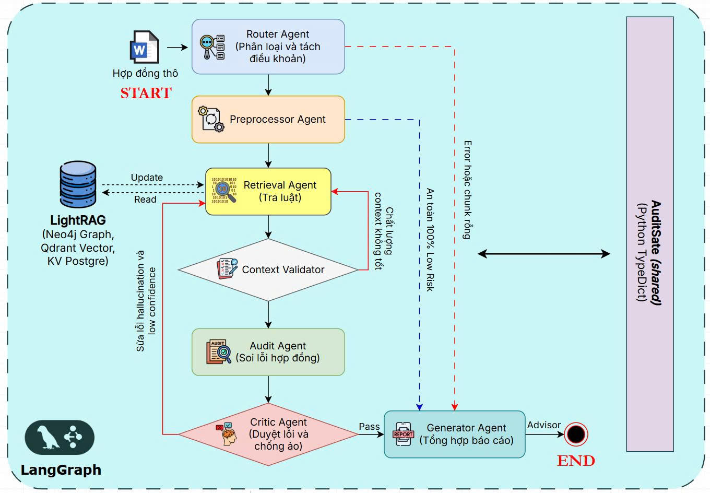

# Viet-Contract Auditor

Viet-Contract Auditor là hệ thống kiểm toán hợp đồng tiếng Việt tự động. Dự án kết hợp **LangGraph** cho pipeline multi-agent, **LightRAG** cho truy xuất pháp lý dạng graph RAG, và storage production gồm **Neo4j + Qdrant + PostgreSQL + MinIO/PyIceberg** để kiểm tra điều khoản, trích dẫn căn cứ pháp lý và sinh báo cáo Markdown.

Đầu vào chính là hợp đồng `.docx`, `.txt` hoặc nội dung văn bản; đầu ra là báo cáo kiểm định gồm phát hiện rủi ro, căn cứ pháp lý, mức độ nghiêm trọng và khuyến nghị sửa đổi.

## Kiến trúc



### Runtime audit

Pipeline audit chạy trên `AuditState` và được điều phối bởi `src/agents/orchestrator.py`:

| Node | Vai trò | Ghi chú |
|---|---|---|
| Router | Phân loại domain hợp đồng và tách điều khoản | LLM + fallback keyword |
| Preprocessor | Chuẩn hóa alias pháp lý, token hóa, phát hiện cross-reference | `underthesea`, không cần LLM |
| Retrieval | Truy vấn LightRAG hybrid qua Neo4j, Qdrant, PostgreSQL | Có rerank tùy cấu hình |
| Context Validator | Chấm coverage, relevance, cross-reference của context | Heuristic |
| Audit | Phát hiện vi phạm và sinh findings có cấu trúc | LLM |
| Critic | Kiểm tra hallucination, phủ định, nitpicking | LLM khi cần |
| Generator | Tổng hợp báo cáo Markdown cuối | LLM + fallback template |

Production runtime không đọc trực tiếp JSON trong `lightrag_index/`; đường serving đúng là qua storage layer và `src/core/lightrag_client.py`.

### Data platform

Dự án đang mở rộng từ ETL một lần sang pipeline cập nhật tri thức pháp lý liên tục:

- `config/legal_sources.yml` là source registry.
- Crawler lấy dữ liệu từ nguồn chính thức trước, ghi provenance cho từng record.
- Local lakehouse debug nằm dưới `data/lakehouse/`.
- Production-local lakehouse dùng PyIceberg với PostgreSQL catalog và MinIO warehouse.
- KG update dùng manifest idempotent để insert/replace tài liệu vào LightRAG.
- Rerank benchmark ghi trace tùy chọn để hiệu chỉnh retrieval.

## Cấu trúc repo

```text
src/
  agents/                    LangGraph audit agents
  core/                      LLM config, LightRAG client, rerank, tracing, shared state
  pipeline/                  Source registry, connectors, lakehouse, versioning, KG update
  ui/                        Streamlit app và components
  run_audit.py               CLI kiểm toán hợp đồng
  init_storage.py            Import artifacts từ lightrag_index/ vào storage production
  check_storage.py           Smoke check Neo4j/Qdrant/PostgreSQL
  crawl_legal_sources.py     Crawler nguồn pháp luật
  lakehouse_validate.py      Validate source registry và lakehouse local/Iceberg
  iceberg_validate.py        Validate PyIceberg SQL catalog + MinIO warehouse
  kg_incremental_update.py   Validate/apply KG update manifests
  kg_update_scheduler.py     Scheduler cho KG update
  pipeline_health.py         Health check pipeline tổng hợp
  e2e_eval.py                Đánh giá end-to-end theo ground truth
  benchmark_*.py             Rerank benchmark, diagnose, calibration

config/
  legal_sources.yml          Registry nguồn luật và chính sách dữ liệu

tests/
  test_legal_pipeline.py     Unit tests cho crawler, lakehouse, KG update, rerank benchmark

lightrag_index/              Artifacts LightRAG prebuilt cho bootstrap/demo
result-example/              Hợp đồng mẫu và ground truth
reports/                     Báo cáo, metrics, benchmark outputs
docker-compose.yml           Neo4j, Qdrant, PostgreSQL, MinIO, Tika, pipeline workers
Dockerfile                   Container chạy app/demo
```

## Yêu cầu

- Python 3.11
- `uv`
- Docker cho production storage stack
- `OPENAI_API_KEY` hoặc `CEREBRAS_API_KEY`

Tạo `.env` từ `.env.example` và không commit khóa thật:

```bash
OPENAI_API_KEY=sk-...
STORAGE_PROFILE=production
POSTGRES_PORT=5433
```

## Chạy nhanh

### 1. Cài dependencies

```bash
uv sync
```

### 2. Khởi động storage production

```bash
docker compose up -d
docker compose ps
```

Stack mặc định gồm:

| Service | Port host | Vai trò |
|---|---:|---|
| Neo4j | 7474, 7687 | Knowledge graph |
| Qdrant | 6333 | Vector store |
| PostgreSQL/pgvector | 5433 | KV, doc status, SQL catalog |
| MinIO | 9000, 9001 | Iceberg object warehouse |

### 3. Import index mẫu vào storage

```bash
uv run python src/init_storage.py
uv run python src/check_storage.py
```

### 4. Chạy kiểm toán hợp đồng bằng CLI

```bash
uv run python src/run_audit.py result-example/HDLD/HDLD_ThucHanh_01.docx --output reports/final_outputs/hdld_report.md
```

### 5. Chạy Streamlit UI

```bash
uv run streamlit run src/ui/streamlit_app.py
```

Mở `http://localhost:8501`.

Demo profile cho môi trường đơn container:

```bash
STORAGE_PROFILE=demo uv run streamlit run src/ui/streamlit_app.py
```

## Pipeline dữ liệu pháp luật

### Validate registry và lakehouse

```bash
uv run python src/lakehouse_validate.py
uv run python src/pipeline_health.py
```

### Validate Iceberg production-local

```bash
uv run python src/iceberg_validate.py --init-tables --counts
```

### Crawl thử không ghi dữ liệu

```bash
uv run python src/crawl_legal_sources.py --since 2026-05-01 --dry-run
```

### Ghi lakehouse local và Iceberg

```bash
uv run python src/crawl_legal_sources.py --source-id congbao --since 2026-05-01 --write-lakehouse --iceberg
```

### Validate và apply KG manifests

```bash
uv run python src/kg_incremental_update.py --dry-run
KG_UPDATE_APPLY=true uv run python src/kg_update_scheduler.py --once
```

Profile `pipeline` chạy scheduler tự động:

```bash
docker compose --profile pipeline up -d
```

Profile này bật thêm Apache Tika, crawler worker và KG update worker.

## Evaluation và benchmark

Chạy end-to-end evaluation:

```bash
uv run python src/e2e_eval.py --groundtruth "result-example/HDLD/groundtruth_hdld_01_test copy.json"
```

Chạy unit tests hiện có:

```bash
uv run python -m unittest tests/test_legal_pipeline.py
```

Chạy rerank benchmark A/B:

```bash
uv run python src/benchmark_rerank_ab.py --groundtruth "result-example/HDLD/groundtruth_hdld_01_test copy.json"
```

Các biến chính cho retrieval/rerank:

```bash
LIGHTRAG_RERANK_ENABLED=true
LIGHTRAG_RERANK_MODEL=cross-encoder/mmarco-mMiniLMv2-L12-H384-v1
LIGHTRAG_QUERY_TOP_K=10
LIGHTRAG_CHUNK_TOP_K=20
LIGHTRAG_CONTEXT_MAX_CHARS=1000
LIGHTRAG_BENCHMARK_TRACE_ENABLED=false
```

## Hugging Face Spaces

Repo vẫn giữ metadata và `Dockerfile` để chạy HF Spaces bằng SDK Docker.

```bash
docker build -t viet-auditor-demo .
docker run -p 7860:7860 -e OPENAI_API_KEY=$OPENAI_API_KEY viet-auditor-demo
```

Khi dùng demo profile, cần có artifacts trong `lightrag_index/`.

## Quy tắc dữ liệu

- Ưu tiên nguồn chính thức Tier 0/Tier 1 cho dữ liệu canonical.
- Nguồn Tier 2 thương mại chỉ dùng discovery/cross-check, không lưu full text vào lakehouse hoặc KG nếu chưa có license/API cho phép.
- Mọi record crawled phải có `source_id`, canonical URL, `fetched_at`, checksum, license note và `doc_id` chuẩn hóa.
- Retrieval corpus và evaluation corpus phải tách biệt.
- KG update phải idempotent: checksum không đổi thì không tạo update; checksum đổi thì tạo version mới và replace manifest.
- Không commit raw crawl output, lakehouse data, crawler state hoặc legal artifacts tải về dung lượng lớn.

## Trạng thái hiện tại

| Mảng | Trạng thái |
|---|---|
| Audit multi-agent với LangGraph | Hoạt động |
| LightRAG production storage | Hoạt động qua Neo4j/Qdrant/PostgreSQL |
| Streamlit UI production/demo | Hoạt động |
| E2E evaluation | Có CLI và ground truth mẫu |
| Legal-source crawler | Đã có registry, connectors, dry-run/write-lakehouse |
| Local + Iceberg lakehouse | Có validation và writer |
| Incremental KG update | Có manifest, dry-run, apply scheduler |
| Rerank benchmark | Có A/B, diagnosis, calibration |

*CS431 - University of Information Technology (UIT) - HK2 2025-2026*
